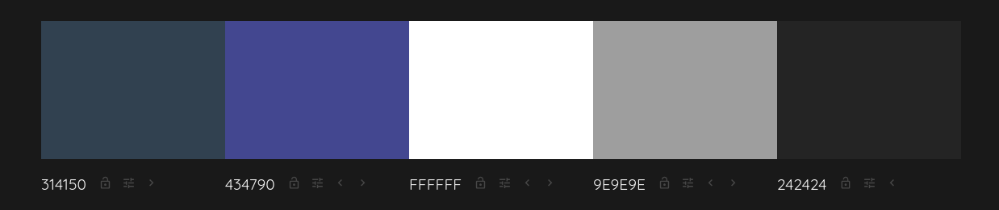

<div align="justify">

# Portfolio

#### Autor: Nabil León Álvarez ([@nalleon](https://github.com/nalleon))

<br>

Práctica de Vue + TypeScript, Pinia y Tailwind desarrollada para los módulos de Desarrollo en entorno de cliente (DEW) y Diseño de interfaces (DOR) durante el curso 2025-2026 en IES Puerto de la Cruz.

## Índice

- [Tecnologías utilizadas](#tecnologías-utilizadas)
- [Estructura](#estructura)
- [Decisiones de diseño](#decisiones-de-diseño)
- [Componentes](#componentes)
    - [Navbar](#navbar)
    - [ProjectCard](#projectcard)
    - [SkillCard](#skillcard)
    - [FrameworkCard](#frameworkcard)
    - [Home](#home)
- [Despliegue](#despliegue)
- [Resultado](#resultado)

### Tecnologías utilizadas


### Estructura

En cuanto a la estructura del proyecto esta ha quedado organizada de la siguiente manera:

```
mi-portfolio/
    │── public/
        │── frameworks/
        │── langs/
        │── other/

    │── src/
        │── assets/
            │── cv/
            │── img/
        │── components/
        │── data/
        │── models/
        │── router/
```

- En `public/` se guardan las fotos que utilizan los json almanecados en `data/`.
- Los contenidos de `assets/` son para la imagen de portada del portfolio y almacenar el cv (ya que este se descarga en la propia página).

### Decisiones de diseño

De cara al diseño, la aplicación acabó teniendo las siguiente característica:

- Una única vista que carga el resto de componentes.

Además se utilizó esta paleta de colores:

<div align="center">
    
</div>

>  Creada utilizando [Colormind](http://colormind.io/).

Cabe destacar que, el diseño principal se **basa** aún así en la **plantilla proporcionada por el profesorado** para la actividad.

### Componentes

#### _Navbar:_

Como podemos observar, es un componente bastante simple que cuya única función es contener y permitir las navegaciones en el portfolio.

```html
<template>
  <header
    class="sticky top-0 bg-slate/80 backdrop-blur border-b border-white/10"
  >
    <div
      class="max-w-4xl mx-auto px-6 py-4 flex justify-between items-center pt-5"
    >
      <span class="font-semibold">Nabil L. A.</span>

      <nav class="flex gap-6 text-sm text-white/70">
        <RouterLink to="/#sobre-mi" class="nav-link">Sobre mí</RouterLink>
        <RouterLink to="/#habilidades" class="nav-link">Habilidades</RouterLink>
        <RouterLink to="/#proyectos" class="nav-link">Proyectos</RouterLink>
        <RouterLink to="/#experiencia" class="nav-link">Experiencia</RouterLink>
        <RouterLink to="/#contacto" class="nav-link">Contacto</RouterLink>
      </nav>
    </div>
  </header>
</template>
```

> Los enlaces son a puntos especificos de la propia vista de Home, ya que toda la aplicación esta en esta.

<br>

#### _ProjectCard:_

Este componente tiene el objetivo de mostrar varios proyectos de mi GitHub que he decidido destacar. Es bastante simple, pues se encarga de recibir tres props (título, descripción y enlace; string) y crear una card.

```html
<template>
  <a
    :href="link"
    target="_blank"
    rel="noopener noreferrer"
    class="block border border-white/10 rounded-lg p-4 hover:bg-white/5 transition cursor-pointer"
  >
    <h3 class="font-medium">{{ title }}</h3>
    <p class="mt-2 text-sm text-white/70">{{ description }}</p>
  </a>
</template>

<script setup>
  defineProps({
    title: String,
    description: String,
    link: String,
  });
</script>
```

<br>

#### _SkillCard:_

Este componente tambien crea una card, pero de los lenguajes y herramientas con las que estoy familiarizado y con las que he creado varios proyectos a lo largo de tanto los dos años de DAM como este año de DAW.

Como podemos observar, recibe por props un objeto SkillCard, el cual es una interfaz que se ha creado:

```ts
import type { BaseCard } from "./BaseCard";

export interface SkillCard extends BaseCard {
  icon: string;
  level: number;
}
```


<details>
    <summary>
        Esta card a su vez extiende de la interfaz BaseCard 
    </summary>
<br>


Ya que hay varios componente que repiten estas propiedades, decidí mover las que eran comunes a un fichero aparte para que el resto de mis componentes que lo necesitaran crearan su interfaz extendiendo de ella.

```ts
export interface BaseCard {
  title: string;
  description: string;
}
```

---

</details>

<br>

```html
<template>
  <div
    class="border border-white/10 rounded-lg p-4 bg-white/5 hover:bg-white/10 transition"
  >
    <div class="flex items-center gap-3">
      <div
        class="h-10 w-10 rounded-md bg-slate-700 flex items-center justify-center"
      >
        
      </div>

      <h3 class="font-medium text-lg">{{ title }}</h3>
    </div>

    <p class="mt-3 text-sm text-white/70">{{ description }}</p>

    <div class="mt-4">
      <div class="flex items-center gap-1">
        <span
          v-for="i in 5"
          :key="i"
          class="h-2 w-6 rounded-full transition"
          :class="i <= level ? 'bg-white' : 'bg-white/20'"
        ></span>
      </div>
      <p class="mt-1 text-xs text-white/50">Nivel: {{ level }}/5</p>
    </div>
  </div>
</template>

<script setup lang="ts">
  import type { SkillCard } from "../models/SkillCard";

  defineProps<SkillCard>();
</script>
```

#### _FrameworkCard:_

Continuamos que un componente que tambien crea una card con una estructura distinta. Su interfaz es la siguiente:

```ts
import type { BaseCard } from "./BaseCard";

export interface FrameworkIcon {
    src: string;
    alt: string;
}

export interface FrameworkCard extends BaseCard {
    icons: FrameworkIcon[];
}
```

```html
<template>
    <div class="border border-white/10 rounded-lg p-4 bg-white/5 hover:bg-white/10 transition">
        
        
        <div class="mt-3 flex items-center gap-3">
            
        </div>
        <h3 class="font-medium text-lg text-left m-2">
            {{ title }}
        </h3>
        
        <p class="mt-4 text-sm text-white/70">
            {{ description }}
        </p>
    </div>
</template>

<script setup lang="ts">
import type { FrameworkCard } from '../models/FrameworkCard'

defineProps<FrameworkCard>()
</script>
```

#### _ContactForm:_

Este componente es simplemente un formulario sin funcionalidades mas allá de la estetíca:

```html
<template>
    <div class="rounded-xl border border-white/10 p-6 mt-5">
        <form class="grid grid-cols-1 sm:grid-cols-2 gap-4">

            <div>
                <label class="block text-xs uppercase tracking-wide text-white/50 mb-1">
                    Nombre
                </label>
                <input type="text" placeholder="Tu nombre" class="w-full rounded-lg bg-white/5 border border-white/10 px-4 py-2
                    text-white placeholder-white/30 focus:outline-none
                    focus:border-white/30 transition" />
            </div>

            <div>
                <label class="block text-xs uppercase tracking-wide text-white/50 mb-1">
                    Email
                </label>
                <input type="email" placeholder="tucorreo@email.com" class="w-full rounded-lg bg-white/5 border border-white/10 px-4 py-2
                    text-white placeholder-white/30 focus:outline-none
                    focus:border-white/30 transition" />
            </div>

            <div class="sm:col-span-2">
                <label class="block text-xs uppercase tracking-wide text-white/50 mb-1">
                    Mensaje
                </label>
                <textarea rows="4" placeholder="Escribe tu mensaje..." class="w-full rounded-lg bg-white/5 border border-white/10 px-4 py-2
                    text-white placeholder-white/30 focus:outline-none
                    focus:border-white/30 resize-none transition" />
            </div>

            <div class="sm:col-span-2 flex justify-center pt-2">
                <button type="button" class="rounded-full not-first:px-6 py-2 text-sm font-medium
                        hover:bg-white/90 transition">
                    Enviar
                </button>
            </div>

        </form>
    </div>
</template>
```

#### _Home:_

Finalmente, llegamos al componente  principal de la aplicación:

```html
<template>
    <Navbar />
    <div id="top" class="min-h-screen bg-slate text-white">
        <div class="w-full max-w-7xl mx-auto px-4 sm:px-6 lg:px-12 py-10">
            <header class="mb-8 text-center">
                <h1 class="text-4xl sm:text-5xl font-bold">
                    Nabil L. A.
                </h1>

                <p class="mt-2 text-white/70 text-lg">
                    Desarrollador
                </p>

                <div class="mt-8 flex justify-center">
                    
                </div>

                <p class="mt-3 text-xs text-white/40">
                    “
                    <a href="https://www.flickr.com/photos/50253654@N06/5241869762" target="_blank"
                        rel="noopener noreferrer" class="underline hover:text-white">
                        Snow!
                    </a>
                    ” by
                    <a href="https://www.flickr.com/photos/50253654@N06" target="_blank" rel="noopener noreferrer"
                        class="underline hover:text-white">
                        neil-5110
                    </a>
                    — CC BY-SA 2.0
                </p>
            </header>


            <section id="sobre-mi" class="scroll-mt-28 mb-16">
                <h2 class="text-2xl font-semibold">Sobre mí</h2>
                <p class="mt-4 text-white/70">
                    Técnico superior en DAM formándose en DAW y apasionado de la tecnología.
                </p>
            </section>
            <section id="habilidades" class="scroll-mt-28 mb-16">
                <h2 class="text-2xl font-semibold">Habilidades</h2>

                <div class="mt-6 grid grid-cols-1 sm:grid-cols-2 gap-6">
                    <SkillCard v-for="skill in skills" :key="skill.title" v-bind="skill" />
                </div>
                <div class="my-12 h-px w-full bg-white/10"></div>

                <div class="mt-6 grid grid-cols-1 sm:grid-cols-2 gap-6">

                    <FrameworkCard v-for="card in frameworkCards" :key="card.title" v-bind="card" />
                </div>
            </section>

            <section id="proyectos" class="scroll-mt-28 mb-16">
                <h2 class="text-2xl font-semibold">Proyectos</h2>
                <div class="mt-6 space-y-12">
                    <div v-for="group in projects" :key="group.period">
                        <h3 class="mb-6 text-lg font-semibold text-white/80">
                            {{ group.period }}
                        </h3>

                        <div class="grid grid-cols-1 sm:grid-cols-2 lg:grid-cols-3 gap-6">
                            <ProjectCard v-for="project in group.projects" :key="project.title" :title="project.title"
                                :description="project.description" :link="project.link" />
                        </div>
                    </div>
                </div>
            </section>
            <section id="experiencia" class="section mb-16">
                <h2 class="text-2xl font-semibold">Experiencia</h2>
                <div class="mt-6 space-y-6">
                    <div class="rounded-xl border border-white/10 bg-white/5 p-6">
                        <h3 class="text-lg font-semibold">
                            FCT
                        </h3>
                        <p class="text-sm text-white/60">
                            Febrero – Mayo (2025)
                        </p>
                        <p class="mt-3 text-white/70">
                            Prácticas en empresa participando en el desarrollo de una aplicación web,
                            implementando tanto la lógica del servidor como la interfaz de usuario.
                        </p>
                    </div>

                    <div class="mt-10 flex justify-center">
                        <a href="/src/assets/cv/cv.pdf" download class="inline-flex items-center gap-3 rounded-full
                                                                            border border-white/10 bg-white/10
                                                                            px-6 py-3 text-sm font-medium
                                                                            hover:bg-white/20 transition">
                            <svg xmlns="http://www.w3.org/2000/svg" fill="none" viewBox="0 0 24 24" stroke-width="1.5"
                                stroke="currentColor" class="size-5">
                                <path stroke-linecap="round" stroke-linejoin="round"
                                    d="M12 3v12m0 0l3-3m-3 3l-3-3m9 6H6" />
                            </svg>

                            Descargar CV (PDF)
                        </a>
                    </div>
                </div>
            </section>

            <section id="contacto" class="scroll-mt-28 mb-16">
                <div class="mt-6 rounded-xl border border-white/10 bg-white/5 p-6">
                    <p class="text-white/70">¿Te interesa contactar conmigo?</p>
                    <ContactForm />
                    <div class="mt-6 flex flex-col justify-center sm:flex-row gap-4">
                        <a href="mailto:nabil14716@gmail.com" class="bg-slate-700 text-black px-2 py-2 rounded-full">
                            <svg xmlns="http://www.w3.org/2000/svg" fill="none" viewBox="0 0 24 24" stroke-width="1.5"
                                stroke="currentColor" class="size-6">
                                <path stroke-linecap="round" stroke-linejoin="round"
                                    d="M21.75 6.75v10.5a2.25 2.25 0 0 1-2.25 2.25h-15a2.25 2.25 0 0 1-2.25-2.25V6.75m19.5 0A2.25 2.25 0 0 0 19.5 4.5h-15a2.25 2.25 0 0 0-2.25 2.25m19.5 0v.243a2.25 2.25 0 0 1-1.07 1.916l-7.5 4.615a2.25 2.25 0 0 1-2.36 0L3.32 8.91a2.25 2.25 0 0 1-1.07-1.916V6.75" />
                            </svg>
                        </a>
                        <a href="https://github.com/nalleon" class="bg-slate-700 text-black px-2 py-2 rounded-full">
                            <svg xmlns="http://www.w3.org/2000/svg" fill="none" viewBox="0 0 24 24" stroke-width="1.5"
                                stroke="currentColor" class="size-6">
                                <path stroke-linecap="round" stroke-linejoin="round" d="M12 2.25c-5.385 0-9.75 4.365-9.75 9.75
                                    0 4.306 2.793 7.955 6.667 9.243
                                    .487.09.666-.211.666-.47
                                    0-.232-.009-.848-.013-1.665
                                    -2.71.589-3.282-1.306-3.282-1.306
                                    -.443-1.125-1.082-1.425-1.082-1.425
                                    -.885-.606.067-.594.067-.594
                                    .979.069 1.494 1.005 1.494 1.005
                                    .87 1.49 2.285 1.06 2.842.811
                                    .088-.63.34-1.06.618-1.304
                                    -2.165-.246-4.44-1.082-4.44-4.814
                                    0-1.063.38-1.933 1.003-2.615
                                    -.101-.247-.435-1.24.096-2.585
                                    0 0 .817-.262 2.675 1
                                    .776-.216 1.608-.324 2.437-.328
                                    .828.004 1.66.112 2.437.328
                                    1.857-1.262 2.673-1 2.673-1
                                    .533 1.345.199 2.338.098 2.585
                                    .625.682 1.002 1.552 1.002 2.615
                                    0 3.741-2.279 4.565-4.45 4.807
                                    .35.302.66.897.66 1.808
                                    0 1.304-.012 2.354-.012 2.674
                                    0 .261.177.565.672.469
                                    3.87-1.29 6.658-4.936 6.658-9.241
                                    0-5.385-4.365-9.75-9.75-9.75z" />
                            </svg>
                        </a>
                    </div>
                </div>
            </section>
            <footer class="text-sm text-white/50">© 2026 — Nabil L. A.</footer>
        </div>
    </div>
</template>

<script setup>
    import ProjectCard from './ProjectCard.vue'
    import SkillCard from './SkillsCard.vue'
    import FrameworkCard from './FrameworksCard.vue'
    import Navbar from './Navbar.vue'
    import ContactForm from './ContactForm.vue'
    import frameworkCards from '@/data/frameworks.json'
    import skills from '@/data/skills.json'
    import projects from '@/data/projects.json'
</script>
```
Como podemos apreciar, este componente se encarga de cargar el resto, proporcionandoles los datos por props, y de crear varias secciones para organizar el contenido.

La foto utilizada ha sido sacada de [CreativeCommon Search](https://search.creativecommons.org/), ya que podiamos o no utilizar una foto nuestra.

### Despliegue

Para el despliegue se ha utilizado `gh-pages` de la siguiente manera y utilizando la documentación oficial de Vue:

1. Accedemos a la carpeta `mi-portfolio/` del repositorio:

```bash
cd mi-portfolio
```

2. Instalamos `gh-pages`

```bash
npm install --save-dev gh-pages
```

3. Añadimos los siguientes scripts a `package.json`:

```json
"predeploy": "npm run build",
"deploy": "gh-pages -d dist"
```

4. Ejecutamos el siguiente comando para desplegar:

```bash
npm run deploy
```


### Resultado

Podemos acceder al portfolio en este [enlace](https://nalleon.github.io/portfolio/).


</div>
